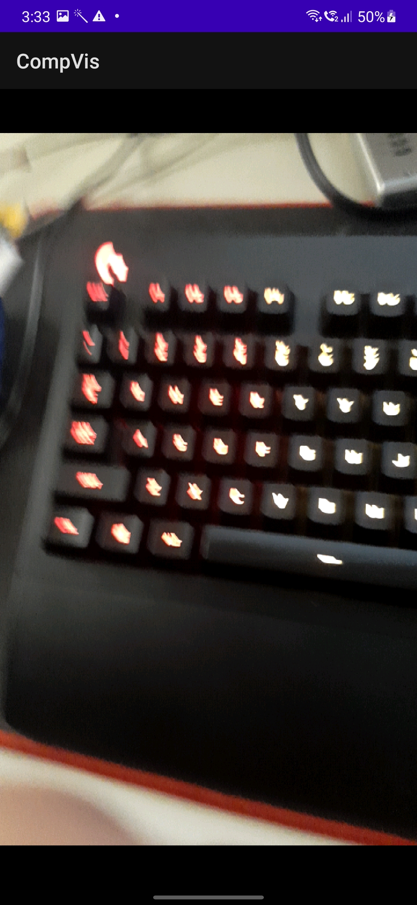

# 📱 EdgeVisionApp


> A real-time Android application using OpenCV + JNI + OpenGL to perform edge detection on camera frames, with modular architecture.


---


## 🎯 Project Overview


EdgeVisionApp is an Android application that captures live video using Camera2 API, processes each frame using C++ (OpenCV via JNI), and renders the output in real-time using OpenGL via GLSurfaceView.


✨ Features:

- ✅ Real-time camera frame capture using **Camera2 API**

- ✅ Native frame processing using **C++ and OpenCV**

- ✅ Live OpenGL rendering with **GLSurfaceView**

- ✅ Modular directory structure

- ✅ Static image testing mode for debugging

- ✅ JNI bridge for native performance


---


## 🧠 Directory Overview


```

EdgeVisionApp/

│

├── /app               # Java / Kotlin Android code

│   ├── MainActivity.java

│   └── ...

│

├── /jni               # C++ native OpenCV logic

│   ├── edge_detection.cpp

│   ├── edge_detection.h

│   └── CMakeLists.txt

│

├── /gl                # OpenGL rendering surface & renderer

│   ├── GLView.java

│   └── GLRenderer.java

│

├── /res/layout        # activity_main.xml (TextureView + GLView)

│

├── /assets            # test.jpg (used for debug processing)

│

└── README.md

```


---


## ⚙️ Tech Stack


- 📷 Android Camera2 API

- 💻 C++ with OpenCV 4.x

- 🔄 JNI (Java Native Interface)

- 🖼️ GLSurfaceView with OpenGL ES 2.0

- 💡 Android Studio Flamingo | Gradle 8+


---

## 🖼️ Screenshots

| Raw Camera Feed | Edge Detection Output |
|------------------|------------------------|
|  |  |

> 📌 These images are located in `app/src/main/assets` and used to demonstrate output frame rendering.

---


## 🚀 How to Run


### 🛠️ Prerequisites


- Android Studio (2023+)

- OpenCV Android SDK

- NDK + CMake installed

- Android device (API 24+)

---

## 🧠 Architecture Overview

```
[Camera2 API]
     ↓
[TextureView Frame Callback]
     ↓
[Java ByteArray → JNI]
     ↓
[Native C++ OpenCV Processing]
     ↓
[Processed Mat → Java Bitmap]
     ↓
[Display in ImageView]
```


### 🔧 Setup Instructions


```bash

1. Clone the repo

2. Open in Android Studio

3. Import OpenCV as a module (from SDK/sdk/java/)

4. Set NDK + CMake paths in project SDK settings

5. Sync Gradle

6. Run the app on a real Android device (emulator not supported for camera)

```


---


## 📂 Native Code (C++)


```cpp

// edge_detection.cpp

JNIEXPORT void JNICALL

Java_com_example_edgevisionapp_MainActivity_processFrame(JNIEnv *env, jobject, jlong inputAddr, jlong outputAddr) {

    cv::Mat &input = *(cv::Mat *) inputAddr;

    cv::Mat &output = *(cv::Mat *) outputAddr;

    cv::cvtColor(input, output, cv::COLOR_RGBA2GRAY);

    cv::Canny(output, output, 80, 100);

    cv::cvtColor(output, output, cv::COLOR_GRAY2RGBA);

}

```


---


## 🧪 Debugging Tips


- Use `test.jpg` in `/assets/` to test `processFrame()` without camera

- Logcat tag: `GLRenderer`, `APP_LAUNCH`, `OpenCV`

- If screen is black:

  - Ensure OpenCV `initDebug()` passes

  - Validate camera permissions and layout IDs

  - Test `GLView` with dummy Bitmap


---


## 📜 License


This project is intended for educational/research purposes only.  

© 2025 EdgeVision R&D — All rights reserved.


---


## 💡 Credits


- [OpenCV](https://opencv.org/)

- Android Camera2 + NDK

- SurfaceFlinger & Android OpenGL Devs


---


